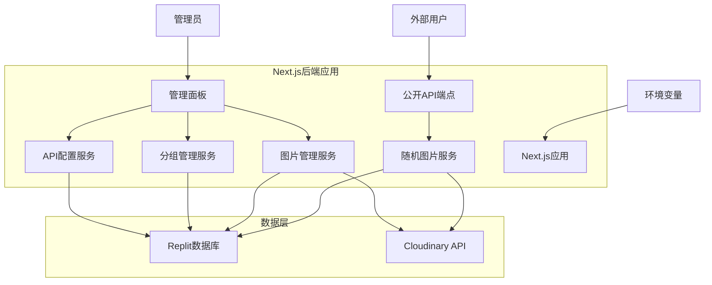

# 设计文档

## 概述

本项目是一个基于Next.js的随机图片API服务，部署在Replit平台上。这是一个后端应用，提供内置的管理面板用于图片管理，同时对外暴露一个公开的API端点供用户获取随机图片。系统集成Cloudinary图床服务和Replit内置数据库，所有管理功能都通过内置界面完成。

## 架构

### 系统架构图



### 技术栈

- **前端框架**: Next.js 14 (App Router)
- **UI组件**: React + Tailwind CSS
- **数据库**: Replit Database (Key-Value存储)
- **图片存储**: Cloudinary
- **部署平台**: Replit
- **环境管理**: Replit Secrets/环境变量

## 组件和接口

### 1. 数据模型

#### Image模型
```typescript
interface Image {
  id: string;
  cloudinaryId: string;
  publicId: string;
  url: string;
  secureUrl: string;
  filename: string;
  format: string;
  width: number;
  height: number;
  bytes: number;
  groupId?: string;
  uploadedAt: Date;
  tags: string[];
}
```

#### Group模型
```typescript
interface Group {
  id: string;
  name: string;
  description: string;
  createdAt: Date;
  imageCount: number;
}
```

#### APIConfig模型
```typescript
interface APIConfig {
  id: string;
  isEnabled: boolean;
  defaultScope: 'all' | 'groups';
  defaultGroups: string[];
  allowedParameters: APIParameter[];
  updatedAt: Date;
}

interface APIParameter {
  name: string; // 参数名，如 'group', 'category'
  type: 'group' | 'custom';
  allowedValues: string[]; // 允许的参数值
  mappedGroups: string[]; // 该参数值对应的分组
  isEnabled: boolean;
}
```

### 2. API端点设计

#### 公开API端点（唯一对外接口）
```
GET /api/random[?参数]
Query参数（由管理员在管理面板中配置）:
- group=分组名 (可选，访问指定分组的图片)
- category=类别名 (可选，其他自定义参数)
- 其他管理员配置的参数...

响应:
- 200: 直接返回随机图片文件
- 404: 没有找到符合条件的图片
- 403: 参数不在允许范围内
- 500: 服务器错误

说明: 
- 这是唯一的公开API端点
- 管理员在管理面板中配置允许的参数和对应的访问范围
- 外部用户通过添加参数来访问不同范围的图片
- 直接返回图片文件，不返回JSON数据
- 未配置的参数将被忽略或返回403错误
```

#### 内部管理端点（仅供管理面板使用）
```
GET /api/admin/images - 获取图片列表（支持分页和筛选）
POST /api/admin/images - 上传新图片
DELETE /api/admin/images/[id] - 删除图片
GET /api/admin/groups - 获取分组列表
POST /api/admin/groups - 创建新分组
PUT /api/admin/groups/[id] - 更新分组
DELETE /api/admin/groups/[id] - 删除分组
GET /api/admin/config - 获取API配置
PUT /api/admin/config - 更新API配置

说明:
- 这些端点仅供内置管理面板使用
- 需要管理员认证
- 外部用户无法访问
```

### 3. 核心服务类

#### CloudinaryService
```typescript
class CloudinaryService {
  async uploadImage(file: File, options?: UploadOptions): Promise<CloudinaryResponse>
  async deleteImage(publicId: string): Promise<void>
  async getImageUrl(publicId: string, transformations?: Transformation[]): string
  async downloadImage(publicId: string): Promise<Buffer>
}
```

#### DatabaseService
```typescript
class DatabaseService {
  async saveImage(image: Image): Promise<void>
  async getRandomImage(groupId?: string): Promise<Image | null>
  async getImages(options: PaginationOptions): Promise<PaginatedResult<Image>>
  async deleteImage(id: string): Promise<void>
  async saveGroup(group: Group): Promise<void>
  async getGroups(): Promise<Group[]>
  async getAPIConfig(): Promise<APIConfig>
  async updateAPIConfig(config: APIConfig): Promise<void>
}
```

## 数据模型

### Replit数据库结构

由于Replit Database是Key-Value存储，我们将使用以下键命名约定：

```
images:{id} -> Image对象
groups:{id} -> Group对象
api_config -> APIConfig对象
image_index -> 图片ID列表（用于随机选择）
group_images:{groupId} -> 该分组的图片ID列表
```

### 数据关系

- 一个图片可以属于一个分组（可选）
- 一个分组可以包含多张图片
- API配置是全局单例
- 使用索引列表优化随机查询性能

## 错误处理

### 错误类型定义

```typescript
enum ErrorType {
  VALIDATION_ERROR = 'VALIDATION_ERROR',
  CLOUDINARY_ERROR = 'CLOUDINARY_ERROR',
  DATABASE_ERROR = 'DATABASE_ERROR',
  NOT_FOUND = 'NOT_FOUND',
  UNAUTHORIZED = 'UNAUTHORIZED',
  INTERNAL_ERROR = 'INTERNAL_ERROR'
}

interface APIError {
  type: ErrorType;
  message: string;
  details?: any;
  timestamp: Date;
}
```

### 错误处理策略

1. **API层错误处理**: 统一的错误中间件捕获和格式化错误
2. **服务层错误处理**: 业务逻辑错误的捕获和转换
3. **外部服务错误**: Cloudinary和数据库错误的重试机制
4. **日志记录**: 所有错误都记录到控制台，包含上下文信息

### 重试机制

- Cloudinary API调用失败时最多重试3次
- 数据库操作失败时最多重试2次
- 使用指数退避策略

## 测试策略

### 单元测试

- 使用Jest和React Testing Library
- 测试所有服务类的核心方法
- 测试API端点的各种场景
- 测试React组件的渲染和交互

### 集成测试

- 测试完整的图片上传流程
- 测试随机图片API的各种参数组合
- 测试数据库操作的一致性

### 端到端测试

- 使用Playwright测试完整的用户流程
- 测试管理面板的所有功能
- 测试API的实际使用场景

### 测试环境配置

```typescript
// jest.config.js
module.exports = {
  testEnvironment: 'jsdom',
  setupFilesAfterEnv: ['<rootDir>/jest.setup.js'],
  moduleNameMapping: {
    '^@/(.*)$': '<rootDir>/src/$1',
  },
  testPathIgnorePatterns: ['<rootDir>/.next/', '<rootDir>/node_modules/'],
}
```

## 性能优化

### UI设计特性

1. **透明度面板界面**: 管理面板支持完全可控的透明度设置
   - 使用CSS rgba颜色实现纯透明背景效果
   - 提供透明度滑块控制面板整体透明度（0-100%）
   - 保持文字和按钮的可读性和可操作性

2. **响应式设计**: 适配不同屏幕尺寸和设备
3. **现代化UI**: 使用渐变、阴影和动画效果
4. **主题切换**: 支持亮色和暗色主题

### 前端优化

1. **图片懒加载**: 管理面板中的图片列表使用懒加载
2. **分页加载**: 大量图片时使用分页减少初始加载时间
3. **缓存策略**: 使用SWR进行数据缓存和重新验证
4. **代码分割**: 管理面板和API使用不同的代码包

### 后端优化

1. **数据库索引**: 使用合适的键结构优化查询性能
2. **随机算法**: 预构建图片索引列表，避免全表扫描
3. **缓存机制**: 缓存API配置和分组信息
4. **连接池**: 复用Cloudinary连接

### Cloudinary优化

1. **图片转换**: 根据用途提供不同尺寸的图片
2. **CDN缓存**: 利用Cloudinary的全球CDN
3. **格式优化**: 自动选择最优图片格式（WebP等）

## 安全考虑

### 环境变量管理

```typescript
// 必需的环境变量
const requiredEnvVars = [
  'CLOUDINARY_CLOUD_NAME',
  'CLOUDINARY_API_KEY',
  'CLOUDINARY_API_SECRET',
  'ADMIN_PASSWORD', // 简单的管理员认证
];
```

### 访问控制

1. **管理面板**: 使用简单的密码认证
2. **API限流**: 防止API滥用
3. **文件类型验证**: 只允许上传图片文件
4. **文件大小限制**: 限制上传文件的最大大小

### 数据验证

- 所有API输入都进行严格验证
- 使用Zod进行运行时类型检查
- 防止SQL注入和XSS攻击

## 部署配置

### Replit配置

```toml
# replit.nix
{ pkgs }: {
  deps = [
    pkgs.nodejs-18_x
    pkgs.nodePackages.npm
  ];
}
```

```bash
# .replit
run = "npm run dev"
entrypoint = "src/app/page.tsx"

[nix]
channel = "stable-24_05"

[deployment]
run = ["sh", "-c", "npm run build && npm start"]
```

### 环境变量设置

在Replit Secrets中配置：
- `CLOUDINARY_CLOUD_NAME`
- `CLOUDINARY_API_KEY`
- `CLOUDINARY_API_SECRET`
- `ADMIN_PASSWORD`
- `NODE_ENV=production`

### 构建优化

```json
// next.config.js
/** @type {import('next').NextConfig} */
const nextConfig = {
  images: {
    domains: ['res.cloudinary.com'],
  },
  experimental: {
    serverComponentsExternalPackages: ['@replit/database'],
  },
}

module.exports = nextConfig
```